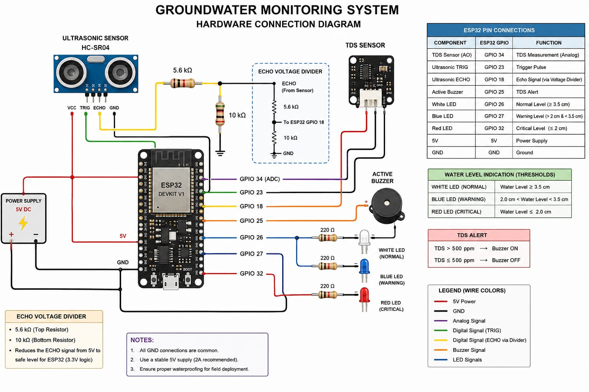

# Project Media

This folder contains the hardware prototype image and demonstration videos
of the **Groundwater Monitoring System**.

## Hardware Demonstration

## Circuit Image



The complete hardware prototype consisting of the ESP32,
TDS sensor, ultrasonic water-level sensor, LEDs and buzzer.

---
## Hardware Setup

The hardware prototype consists of an ESP32-based monitoring unit integrated
with a TDS sensor, ultrasonic water-level sensor, LED indicators and an
active buzzer for local alerts.

<p align="center">
  
</p>

<p align="center">
  <i>Hardware prototype of the Groundwater Monitoring System</i>
</p>

## Demonstration Videos

### 1. TDS Alert Buzzer

Demonstrates the audible warning generated when the measured TDS value
crosses the configured threshold of **500 ppm**.

[▶ Watch TDS Buzzer Alert on YouTube](https://youtu.be/CHl_UEb8vh4)

---

### 2. Water-Level LED Indicators

Demonstrates the three water-level status indicators:

| LED | Condition | Status |
|---|---|---|
| White | ≥ 3.5 m | Normal |
| Blue | > 2 m and < 3.5 m | Warning / Medium |
| Red | ≤ 2 m | Critical / Low |

[▶ Watch Water Level LED Alert on YouTube](https://youtu.be/RgPJi_KCC2A)

---

### 3. Real-Time Dashboard

Demonstrates the real-time monitoring dashboard receiving groundwater
measurements from the ESP32 through Wi-Fi and Flask.

The dashboard displays:

- Water level
- TDS value
- Village
- Well
- Recorded measurements

[▶ Watch Real-Time Dashboard on YouTube](https://youtu.be/41BdZGNdYzY)

---
## Project Presentation

The complete project presentation covering the problem statement, proposed
system, hardware implementation, software architecture, results, and future
scope is available below.

[📑 View Project Presentation](media/Groundwater-Monitoring-System-Presentation.pptx)
---

# Hardware Pin Connections

| Component | ESP32 Pin | Purpose |
|---|---:|---|
| TDS Sensor Analog Output | GPIO 34 | TDS measurement |
| Ultrasonic TRIG | GPIO 23 | Trigger pulse |
| Ultrasonic ECHO | GPIO 18 | Echo measurement |
| Active Buzzer | GPIO 25 | TDS warning |
| White LED | GPIO 26 | Normal water level |
| Blue LED | GPIO 27 | Medium/warning level |
| Red LED | GPIO 32 | Critical/low water level |

## LED Connections

Each LED is connected with a **220 Ω resistor** in series.

```text
ESP32 GPIO → 220 Ω resistor → LED → GND
```
## Ultrasonic ECHO Voltage Divider

The ESP32 operates at **3.3 V logic**, while the ultrasonic sensor can
provide approximately a **5 V ECHO signal**. A resistor voltage divider is therefore
used to reduce the ECHO voltage to a safer level for the ESP32 GPIO.

The voltage divider uses:

- **5.6 kΩ resistor** — connected between ultrasonic ECHO and ESP32 GPIO 18
- **10 kΩ resistor** — connected between ESP32 GPIO 18 and GND

```text
Ultrasonic ECHO
      │
    5.6 kΩ
      │
      ├──────────→ ESP32 GPIO 18
      │
    10 kΩ
      │
     GND
```
